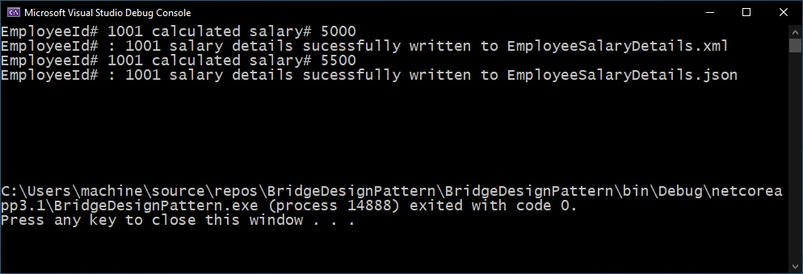

# Bridge Design Pattern in C# Implementation

Let us build a .NET Core C# console application to implement the Bridge Design Pattern using a very simple requirement. The requirement of the application is defined as follows:

## Requirement Description

A client processes employee salary details and want to save the processed data to an XML or a JSON file. The saving of data to a specific file format will be decided during the runtime and the client can introduce other formats in the near future. The salary processing remains the same and won’t change, but the file format can vary.

## Application Output

